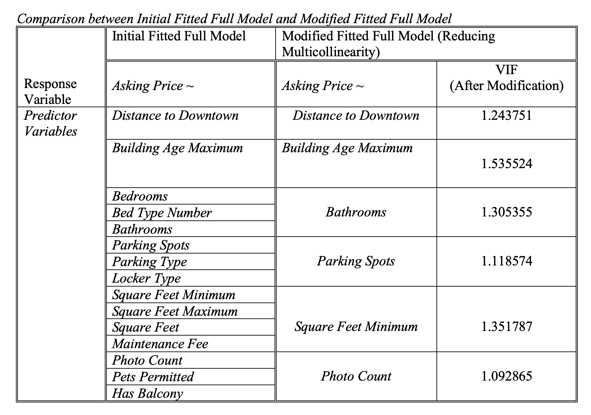
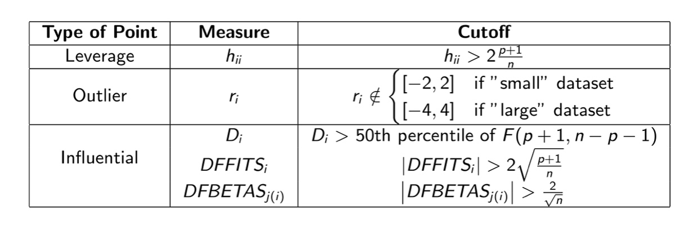
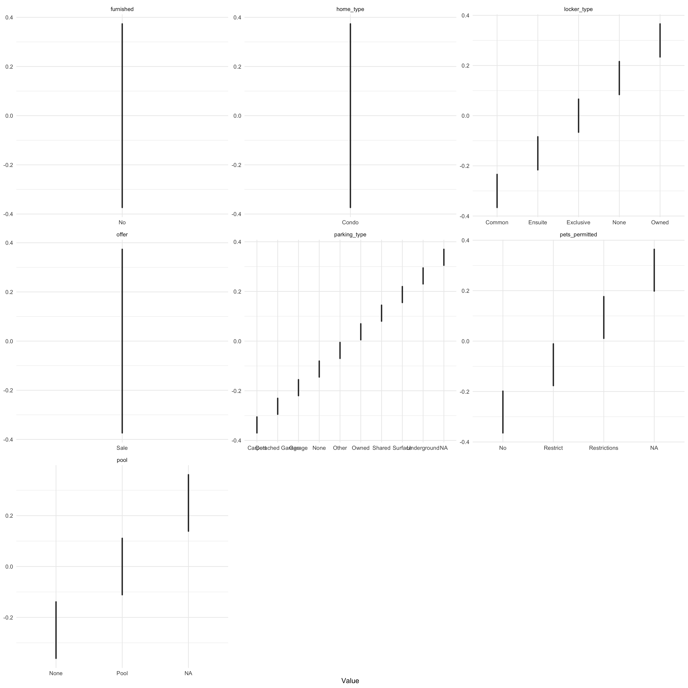

```{r setup, include=FALSE}
knitr::opts_chunk$set(cache = T, echo=FALSE, warning=FALSE, message=FALSE, results = FALSE, error=FALSE)

#Import needed packages using the function "library".
library(tidyverse)
library(here)
library(car)
library(GGally)
library(leaps)
library(MASS)
library(knitr)
library(ggplot2)

#Load the original data set.
data <-
  read_csv(here::here("inputs/data/toronto.csv"))
```

```{r glimpse, include=FALSE}
#Check some basic characteristics of the original data using functions "glimpse", "colnames".
glimpse(data)
colnames(data)

```


\newpage
# Introduction
Toronto Housing market and real estate has boomed over the last decade. Investors would often face questions like “what is affecting Toronto real estate prices?”. First, we need to understand if the housing market is mainly fueled by supply and local demand, or there are external factors. Also, condos are an entirely different segment than detached houses, in the same way Hamilton is an entirely different market than Toronto[@Jordon]. So, our analysis would focus only on the Toronto Condo Apartment market. This category includes all apartments and condominiums. These are complexes of residential units with common areas such as hallways, parking lots, stairwells, etc.[@WOWA]. Since the average price of condos was $715,104 in November 2021, we would narrow our research focusing on Condos with price lower than $1.5 million in despite of those with extremely high prices.

We retrieved data from the website Condos.ca( https://www.condos.ca/) on 2021, December 5 for all kinds of information and asking prices that are public to potential buyers and sellers. Our research would be conducted through Multiple Linear Regression (MLR) Model to estimate the statistical linear relationship between one outcome/response variable with two or more explanatory/predictor variables. Our final model has response variable as Toronto condo asking price, and predictor variables as Distance to Downtown, Building Age Maximum, and Square Foot Minimum. We would introduce our methods, results, interpretations, and limitations in the following sections. We aimed to provide reasonable information for audience like buyers, sellers, and agencies who are interested in condos in Toronto with price lower than $1.5 million.

 We would introduce our methods, results, interpretations, and limitations in the following sections.

\newpage
# Data

We started our analysis by using R [@citeR], tidyverse[@tidyverse], here[@here], car[@car], GGally[@GGally], leaps[@leaps], MASS[@MASS], knitr[@Xie2021-ps], and ggplot2[@ggplot2].

## Data Source

We retrieved data from the website Condos.ca( https://www.condos.ca/) on 2021, December 5 for all kinds of information and asking prices that are public to potential buyers and sellers[@condos]. Indeed, there are various real estate trade and listing websites available. However, we chose to obtain data from Condos.ca because it is the website that focuses on the condo trading market in Toronto which perfectly match our topic. It also contains substantial condo transactions with available information on all kinds of features of the condos. The framework of basic information is well structured on the website. Condo listings would provide needed information accordingly. This is an essential reason to choose this data since it indicates that people would be exposed to similar information so that it could limit impacts from external unknown factors. Even though the data may not be able to capture every transaction happened in Toronto, the well formatted information framework would provide a solid foundation for us to formalize our model. Also, the differences in prices would not be significant if the units have similar condition, especially same locations and areas.

There are 2511 entries in the original data set. As we would like to focus on condo prices, Figure \@ref(fig:hometype) shows that there are sufficient observations for Condo so we could continue our analysis. The data provides information about identification, physical measurement, community, and current conditions of the condo. Most of the variables are numerical while most non-numeric variables are identification records of the subject which would not be analyzed. Usually, sellers would have a listing price that incorporates considerations of all kinds of information about the selling unit. While most of them would base their asking price logically, some of them may also misprice due to their financial needs like loans or mortgages.


```{r hometype, fig.cap="Bar Chart of Home Types in Original Dataset", echo=FALSE}
# Checking the home types of the original dataset to see if the data qualifies our topic focuses on Condo by using ggplot2.
data %>% 
  ggplot(mapping = aes(x = home_type)) +
  theme_classic() +
  labs(x = "Count",
       y = "Home Type",
       title = "Bar Chart of Home Types in Original Dataset") +
  geom_bar()
# There are sufficient observations for Condo so we could continue our analysis.
```


## Methodology and Data Collection
Before we start, we cleaned the dataset to focus on only condos in Toronto and only the asking price accordingly. Asking price, also known as the listing price, refers to how much a seller has listed a property for, and sale price refers to the amount it actually sells for. It usually reflects the market condition as sellers would provide the asking price according to all available information about the unit selling. 

There is also much excess information like other property types and many inapplicable variables that would be problematic for us to build the model. We created a new predictor variable called “Distance to Downton” which combines all location information by using the CN Tower as a benchmark. To avoid extreme cases with abnormally high trading prices, we filtered condos with an asking price not higher than $1.5 million. Some variables like bedrooms, bathrooms, and parking spots were inconsistent for comparison, so we transformed them as needed to keep the same unit measure. We also reverse selected variables that are inapplicable or unrelated to our topic. Therefore, there are 2002 observations and 22 variables after cleaning the data for further analysis.

Locations have been a popular topic whenever people think of real estate investment. Generally, the real estate market could be classified geographically since it also incorporates features like weather, environment, income level, economy, politics, security, financial policies, and transportation for investors to consider. To have a glimpse into our data, Figure \@ref(fig:locations-and-buildingage) shows how the asking price is distributed according to the distance to downtown among different buildings. Referring to Figure \@ref(fig:locations-and-buildingage), we could see that there are more relatively new buildings near downtown. Also, we could see large clusters of points below 1,000,000 and above 500,000 which implies that most of the condos have an asking price between $0.5 and $1 million dollars.

```{r data cleaning, include=FALSE}
#Select home type that is Condo, and response variable = sale offer asking prices,for my topic : What is affecting the Condo Asking Price in Toronto?
#Only keeping condos with asking price <= 1.5 million dollars
#Create a single measurement for location as distance to downtown using CN Tower (latitude = 43.642567,-79.387054) as the benchmark, transform degree to km -> *110
#Variables: bedrooms, bathrooms, parking spots are mathematically transformed as needed to keep the same unit measure
#Reverse select variables that are inapplicable for our topic or it is inapplicable to perform a multiple linear regression model

data_cleaned <- data %>%
  filter(home_type == "Condo", 
         offer == "Sale",
         asking_price <= 1.5e6)%>%
  mutate(distance_to_dt = sqrt((latitude-43.642567)^2+(longitude+79.387054)^2)*110, 
         has_locker= as.logical(has_locker),
         bedrooms=bedrooms/sqft_max,
         bathrooms=bathrooms/sqft_max,
         parking_spots=parking_spots/sqft_max) %>%
  dplyr::select(
    !c(date_available,
      date_available_period,
      exposure,
      outdoor_space,
      created_at,
      source_timestamp,
      slogan,
      amenities,
      tags,
      title_to_land,
      filter_type,
      filter_value,
      type,
      subtitle,
      open_houses,
      `_geoloc`,
      objectID,
      `_highlightResult`,
      mls_number,
      coordinates_source,
      coordinates_geohash,
      title,
      sub_type,
      status,
      banner_id,
      property_class,
      property_type,
      unit_name,
      unit_number,
      corporation_jurisdiction,
      corporation_number,
      advertise_permission,
      featured,
      exclusive,
      promoted,
      building_id,
      building_age,
      address_id,
      street_id,
      neighbourhood_id,
      neighbourhood_name,
      latitude,
      longitude,
      locality_id,
      locality_name,
      locality_parent_id,
      locality_parent_name,
      locality_grandparent_id,
      locality_grandparent_name,
      province_id,
      province_name,
      country_id,
      country_name,
      url,
      tax,
      tax_year,
      bedrooms_plus,
      bed_type,
      sqft_source,
      lot_size,
      lot_front,
      lot_depth,
      pin_to_front,
      ranking,
      photo_version,
      photo_base_url,
      furnished_id,
      property_class_name,
      entry_date,
      entry_date_unix,
      street_name,
      brokerage,
      brokerage_id,
      brokerage_name,
      sublocality_id,
      sublocality_name
    )
  )
  
factors <- NULL

for (i in colnames(data_cleaned)) {
    if (class(data_cleaned[[i]]) == "character") {
      factors = c(factors, i)
    }
}

# Saving the cleaned data set into the "inputs/data" folder for further reference using the function "write_csv".
data_cleaned%>%
  write_csv(here::here("inputs/data/cleaned.csv"))
```


```{r locations-and-buildingage, fig.cap="Relationship between Asking Price and Locations of Different Building Age Max", fig.width=8, fig.height=6, echo=FALSE, message=FALSE}
#Creating a plot which visualize the Relationship between Asking Price and Locations of Different Building Age using ggplot2 after cleaning the data
data_cleaned%>%
  ggplot(mapping = aes(x = distance_to_dt, y = asking_price, color = building_age_max)) +
  labs(title = "Relationship between Asking Price and Locations of Different Building Age",
        x = "Distance to Downtown",
        y = "Asking Price") +
  theme_classic() +
  geom_point()
```


\newpage

# Model

To provide useful information for people interested in real estate investment, we need to estimate a relationship that describes how the change in our predictors corresponds to values in our response. As we are trying to express the statistical relationship, we are not restricted to only looking at the relationship between one predictor and the response. Moreover, when assessing whether the collected data fits our model, it is always important to assess whether any of the model’s assumptions are violated. We also provided a Model Card as shown in the Appendix \@ref(appendix1) [@doi:10.1080/10691898.2001.11910537;@SINHARAY20101;@algorithm;@metrics].

## Statistical Model for Multiple Linear Regression
It is common to have more than one factor to influence an outcome. By applying Multiple Linear Regression Model (MLR), we expect to find numerous factors that are related to our response variable. Unlike in Simple Linear Regression, where there is only one predictor for the response variable, in MLR, the number of predictors is $p \in \mathbb{N}$ predictors.

$Y_i = \beta_0 + \beta_1 X_{i1} + \beta_2 X_{i2} + \cdots + \beta_p X_{ip} + \varepsilon_i$

- $Y_i$ is the response variable, a.k.a. dependent variable.
- $X_{ij}$ is the explanatory variable, a.k.a. independent variable.
- $\beta_0$ is the intercept parameter. Statistically, it is the expected value of $Y_i$ when $X_{ij} = 0$.
- $\beta_i$ is the slope parameter.
- $\varepsilon_i$ is the random error, caused by variation of measure that we cannot count for.

Since we are working with observations from a distribution, we need to incorporate error to represent that the data comes from a distribution that itself has variation. Just like Simple Linear Regression, the Multiple Linear Regression model also assumes that $\varepsilon_i \stackrel{\text{i.i.d}}{\sim} \mathcal{N}(0, \sigma^2)$. Therefore, the Simple Linear Regression is a special case of Multiple Linear Regression Model, where $p = 1$. With this assumption, we know that the model has $p + 2$ parameters in total, $(p + 1)$ $\beta_i$'s, and the variance of the error term, $\sigma^2$. Since there are $(p + 2)$ parameters, we will need at least $p + 2$ observations in order to fit the model and get an estimate for the parameter.


## Validation and Assumptions

First of all, it is crucial that we could validate our final model, so we use the Validation Methods to check if our final model is good enough not only for our collected sample but also for others from the same population. We randomly created a “train dataset” that would be used to implement all of our analysis and a “test dataset” for evaluations. 

Secondly, we would perform an Exploratory Data Analysis (EDA) to identify potential model violations. Recall that Multiple Linear Regression model also assumes that $\varepsilon_i \stackrel{\text{i.i.d}}{\sim} \mathcal{N}(0, \sigma^2)$. Therefore, we would also assess the assumptions mentioned below formally with Residual Scatter Plots. Residuals are the distance between the true values and our fitted value so that any violations in assumptions should also appear in the residuals. 
The estimated residual is defined by 
$$\hat{e}_i = y_i - \hat{y}_i = y_i - b_0 - b_1 x_i$$
We would like to visually assess whether an appropriate regression line has been fitted to the data. If no pattern is found in the residual scatter plots, then it indicates that the model provides an adequate summary of the data. If a pattern is found, then the shape of the pattern would provide information on the function of $X$ that is missing from the model.


We also need to check two conditions first to examine if a linear relation model were inappropriate and if there are highly non-linear relations between our predictors. Simultaneously, we do not want any strong correlations between any of the predictor variables which is Multicollinearity. Multicollinearity could lead to misunderstanding and much larger standard errors. So, we would use the Variance Inflation Factor (VIF) to measure how inflated the errors will be due to the relationship of one predictor to the others. If any significant violations are detected, we would see whether a transformation was needed.


Overall, we need to make sure it is reasonable for us to apply the MLR Model by checking these assumptions:

- Response variable is related to predictor variables by the linear regression model that only the predictors we are including as predictors are related to the response. 
  - Do not want to see any systematic patterns in residual plots, such as a curve.
- The errors are uncorrelated.
  - Do not want to see large clusters of residuals that have obvious separation from the rest.
- The errors have a common variance.
  - Do not want to see any pattern especially a fanning pattern where residuals gradually become more spread out.
- The errors are Normally distributed.
  - Do not want to see severe deviations in residuals.

Then, we need to analyze whether there are problematic observations such as Leverage points, Outliers, and Influential points according to their measurements and cutoff values in Appendix \@ref(appendix2). An **outlier** is a point located off the trend of the other observations. An outlier with respect to the response variable will lead to large residuals and can potentially affect the estimated regression line. A \textbf{leverage point} is characterized as being a single observation whose predictor values are overall quite distant from the center of mass of all predictors. They can have a disproportionate impact on the placement of the regression line (or equivalently on their own fitted value). \textbf{Influential points} generally do impact the estimated regression line but may not necessarily be a leverage point or outlier or both. It is important to check all three of these types of problematic observations for us to fully understand why the estimated regression line is being placed where it is.

Finally, we would go over the automated selection processes to learn about what are the suggested models. Since we are expected to have a large number of predictors initially, automated ways could be especially helpful to obtain an overall sense of preferred models. Throughout our analysis, we would also refer to measurements like Adjusted $R^2$ as complementary benchmarks. It is named adjusted $R^2$ because it is adjusted for the number of predictors in the model. It is better to use adjusted $R^2$ instead of $R^2$ since $R^2$ would no longer be helpful to tell whether additional predictors are useful for explaining the response variable as the number of variables (p) increases. Combine with contextual reasons, we would generate three preferred models for validation. We would fit them in our test dataset to compare their properties, understand potential limitations, and choose the final model. In the end, instead of modifying our previous analysis, we would conclusively discuss our results with observed limitations.

\newpage

# Results

Firstly, we look at the distribution of our response variable which is applicable for an MLR. From Figure \@ref(fig:asking-price-distribution), we could see the distribution of Asking Price is mostly normally distributed but slightly right-skewed. But it is Unimodal and good enough to proceed with the Multiple Linear Regression model.

```{r asking-price-distribution, fig.cap="Asking Price Distribution Histogram", fig.width=4, fig.height=3, echo=FALSE, warning=FALSE, message=FALSE, results = FALSE, error=FALSE}
# Checking the Distribution of our response variable "Asking Price" by visualizing a histogram using ggplot2.
data_cleaned %>%  
  ggplot(aes(x = asking_price)) +
  geom_histogram(aes(y=..density..), bins=10, colour = "black", fill = "light yellow") + 
  theme_classic() +
   labs(x = "Asking Price",
        y = "Density")+
  geom_density()
#The distribution is not perfectly Normal, slightly skewed, but it is unimodal and good enough to proceed with multiple linear regression model.
```


```{r validation, include=FALSE}
#Create train and test data set 50/50 to implement the Validation Method, and prepare for the validation at the end. 
#Saving the created data sets into the "inputs/data" folder for further reference using the function "write_csv".
set.seed(1)
train <- data_cleaned[sample(1:nrow(data_cleaned), 0.5 * nrow(data_cleaned), replace=F), ]
test <- data_cleaned[which(!(data_cleaned$id %in% train$id)),]
train%>%
  write_csv(here::here("inputs/data/cleaned_train.csv"))
test%>%
  write_csv(here::here("inputs/data/cleaned_test.csv"))

```

```{r train and test comparison, include=FALSE, warning=FALSE}
#Check if the train data set and test data set are capturing similar observations by comparing their mean and standard deviation
mtr <- lapply(train, mean)
sdtr <- lapply(train, sd)
mtest <- lapply(test, mean)
sdtest <- lapply(test, sd)

cbind(mtr, sdtr, mtest, sdtest) %>% knitr::kable(digits = 4)
# There are no significant deviation between train and test data sets so it is good to proceed.
# Analysis would be conducted on the Train Data Set and apply to the Test Data Set at the end for validation.
```


We also performed some Exploratory Data Analysis (EDA) to identify potential model violations. Our EDA results suggested there are potential linear relations between our response and predictor variables with no significant assumption violations. Figure \@ref(fig:scatterplots) and Figure \@ref(fig:boxplots) shows the potential relation between numerical and categorical predictor variables and our response variable – Asking Price. However, we detected some variables that only have one level as shown in Appendix \@ref(appendix3). Since they would be inapplicable and not meaningful for us to apply the MLR model, we removed them before we fit our initial full model.

```{r scatterplots, fig.cap = "Scatterplots of Numerical Predcitor Variables", warning=FALSE, message = FALSE, error = FALSE, echo=FALSE, fig.width=8, fig.height=7, fig.pos = "!H"}
# Visualizing the potential relationship between Numeric predictor variables and response variable through Scatter plots by using ggplot2
train[!colnames(train) %in% factors] %>%
  pivot_longer(colnames(train)[!colnames(train) %in% factors][-2],
               values_to = "Value", names_to = "Variable") %>%
  ggplot(aes(x = Value, y = asking_price )) +
  geom_point() +
  geom_smooth(method = "lm", se = FALSE, colour = "blue") +
  facet_wrap(~Variable, nrow = 4, scales = "free") +
  theme_minimal() +
  labs(x = "",
       y = "Asking Price",
       title = "Scatterplots of Numerical Predcitor Variables")
ggsave("scatterplots.png", width = 15, height = 15, units = "in")
```

```{r boxplots, fig.cap='Boxplots of Categorical Predictor Variable', warning=FALSE, fig.width=17, fig.height=15, echo=FALSE}
# Visualizing the potential relationship between Categorical predictor variables and response variable through Box plots by using ggplot2
train %>%
  pivot_longer(factors,
               values_to = "Value", names_to = "Variable") %>%
  ggplot(aes(x = Value, y = asking_price )) +
  geom_point() +
  geom_boxplot() +
  facet_wrap(~Variable, nrow = 3, scales = "free") +
  theme_minimal() +
  labs(x = "",
       y = "Asking Price",
       title = "Boxplots of Categorical Predictor Variable")
ggsave("boxplots.png", width = 15, height = 15, units = "in")
```


```{r levels, include=FALSE, warning=FALSE}
#Visualizing those predictors with only one level of value and save the output as levels.png using ggsave
train[colnames(train) %in% factors] %>%
  pivot_longer(colnames(train)[colnames(train) %in% factors], values_to = "Value", names_to = "Variable") %>%
  ggplot(aes(x = Value)) +
  theme_minimal() +
  geom_boxplot() + facet_wrap(~Variable, scales = "free")
ggsave("levels.png", width = 15, height = 15, units = "in")
```

```{r remove one level varaibles, include=FALSE}
#Delete the variables that only have one level as all their entries has only one value.
train <- train %>% 
  dplyr::select(!c(id, pool, offer, furnished, home_type, has_locker))
colnames(train)
```

\newpage

Problems of interpretation would arise when we have correlated predictors. The issue is called Multicollinearity. The initial full model we fitted has large risk of multicollinearity. So we further eliminated the variable “Square Feet Maximum” according to the VIF results as shown in the table below.



We also rechecked our model to make sure the two Priority Condition are satisfied. Satisfying these two conditions would help us interpret our residual plots. We can use a plot of the response against the fitted values to determine whether Condition1 holds. As shown in Figure \@ref(fig:condition1), the points are randomly scattered around with no significant deviations among the functions. We also rechecked Condition 2 after we made modifications to our full model. As shown in Figure \@ref(fig:recheck-condition2),  there are no predictor variables with highly non-linear relations. Since both conditions are satisfied, we could analyze the residual plots and identify potential limitations.

Overall, the residual plots in Figure \@ref(fig:residual-plots) are randomly distributed with no distinguishable patterns. Admittedly, there is potential for Distance to Downtown, Bathrooms, and Photo Count to violate the constant error variance assumption as there are mild fanning patterns in their residual plots. However, our Likelihood ratio test results suggested that no transformation is needed. Moreover, our Normal QQ Plot shown in Figure \@ref(fig:normalqq) has good relationship without severe deviations, so our fitted model is satisfactory to proceed.


```{r initial full model, include=FALSE}
#The first full model is created for further reference.
full_1<- lm(asking_price ~., data = train)
summary(full_1)

```

```{r vif1, include=FALSE}
#checking multicollinearity
vif(lm(asking_price ~., data = train)) %>%
  as.data.frame() %>%
  filter(`GVIF^(1/(2*Df))` > 5)
```

```{r remove sqft_max, include=FALSE}
#removing sqft_max since it has significant multicollinearity
train <- train %>%
  dplyr::select(!c(sqft_max))
colnames(train)
```


```{r condition2, include=FALSE, warning=FALSE}
#Also check if there are more potential multicollinearity along with checking Condition 2
train[,-c(1,1)] %>% na.omit() %>% ggpairs()
ggsave("condition2.png", width = 15, height = 15, units = "in")

#Further detect some multicollinearity between predictors through the graphs
```

```{r selected train, include=FALSE}
#keeping the variables that do not appear to have significant multicollinearity
selected_train <- train %>%
  dplyr::select(asking_price, distance_to_dt, building_age_max, bathrooms, parking_spots, sqft_min, photo_count)
selected_train%>%
  write_csv(here::here("inputs/data/selected_train.csv"))

```

```{r condition1, fig.cap="Conditon1 - Response & Fitted Value", echo=FALSE}
# Condition 1 checking
o <- order(full_1$fitted.values)

conditon_1 <- plot((full_1$fitted.values + full_1$residuals) ~ full_1$fitted.values, main="Y versus Y-hat", xlab="Y-hat", ylab="Y")
abline(a = 0, b = 1) 
lines(lowess(I(full_1$fitted.values + full_1$residuals) ~ full_1$fitted.values), lty=2)
```

```{r recheck-condition2, fig.cap="Condition 2 Rechecked - Relationships Among Variables", fig.width=15, fig.height=15, echo=FALSE, warning=FALSE}
#checking condition 2 and multicollinearity again on the new selected predictors
selected_train %>% na.omit() %>% ggpairs()
ggsave("condition2-rechecked.png", width = 15, height = 15, units = "in")
```

```{r full2, include=FALSE}
# Revised full model according to Multicollinearity existance
full2<- lm(asking_price ~., data = selected_train)
summary(full2)
vif(full_1)
vif(full2)

```


```{r cehckingfull1, include=FALSE}
#checking full1 model length
full_1$fitted.values %>% length()
```


```{r checking-NA, include=FALSE}
# see how many N/A in each variable
f <- function(x) {
  x %>% is.na() %>% sum()
}

lapply(selected_train, f)
```

```{r residual-plots, fig.cap="Residuals versus Predictor Plots", echo=FALSE}
#checking the residuals and predictors relationship
par(mfrow=c(2,4))
for(i in c(2:7)){
  plot(rstandard(full2) ~ na.omit(selected_train)[[i]], xlab=names(selected_train)[i], ylab="Residuals")
}
```

```{r normalqq, fig.cap="Normal Quantile-Quantile(QQ) Plots and Residuals versus Fitted Values Plots", echo=FALSE}
#Checking first three assumptions by using residual plots, and check Normal assumption with Normal QQ plot
par(mfrow=c(2, 2))
plot(full2)

```


```{r check transformation, include=FALSE}
#Check if a transformation is needed
p <- powerTransform(lm(asking_price ~ ., data = selected_train))
summary(p)
#decide not to perform transformation
```

```{r recheck vif, include=FALSE}
#checking multicollinearity again

vif(full2)

colnames(selected_train)

#no significant Multicollinearity which is good
```

The final check is to visualize the effects of Leverage points, Outliers, and Influential observations. By using the measurements and cutoffs accordingly as shown in Appendix \@ref(appendix2), we do have some Leverage points shown in Figure \@ref(fig:leverage-points). However, due to the large sample size, this is not very concerning. Also, we only detected 4 Outliers as shown in Figure \@ref(fig:outliers) which means there is a small potential for our trend to be largely impacted. We did have more Influential observations shown in Figure \@ref(fig:influential), but many are repeated captures with Leverage points which is a good sign as we want to have a relatively fixed group of problematic observations. However, since we do not have any contextual reason to delete these problematic observations, we would simply acknowledge their existence when discussing the limitations of our model.

\newpage

The regression equation will not be useful if it is very complicated or a function of a large number of explanatory variables. So, we generally want the model to be as simple as possible to adequately describe the response variable. However, without the knowledge of the exact logical connection between the response and explanatory variables, it is unwise to think there exists an exact, discoverable equation. Many possible models will exist. To develop our preferred models, we went through the All Possible Subsets selection process and Stepwise selection to overcome the issue of changing statistical significance and account for the conditional nature of the model. We generated our first preferred model from the results of Stepwise selection using AIC as criteria. There is a consensus on the resulted model from all possible processes and stepwise selection, so we chose it as the second model. However, their strict adherence to guidelines could result in overfitting regardless of contextual information. We generated our third model which eliminated the predictor variable “Bathrooms” since we believe the area of bathrooms in a condo also depends on the square foot minimum. 

As the automated selection methods would proceed without warnings of model violations or multicollinearity, we checked assumptions for each preferred model. After comparisons from the summary between the preferred model and the corresponding test model, we reached a result of choosing Preferred Model 3 as the final model focusing on the perspectives of coefficients as parameters and adjusted R squared. Our final model suggested that 
Toronto condo Asking Price ~ Distance to Downtown + Building Age Maximum  + Square Foot Minimum with the Adjusted $R^2$ equal to 0.6675. It implies that our model explains approximately 66.75% of the variations in the response. In other words, distance to Downtown, maximum building age, and minimum square foot could explain 66.75% of the variations in Toronto condos' asking price. 

\newpage

```{r leverage-points, fig.cap = "Leverage Points", fig.height=4, fig.width=8, warning = FALSE, message = FALSE, echo=FALSE}
#Check if there are leverage points
#Leverage point a single observation whose predictor values are overall quite distant from the center of all the predictors 

p <- length(coef(full2))-1
n <-length(selected_train$asking_price)
p
n

h <- hatvalues(full2)
threshold <- 2 * (p+1)/n
w <- which(h > threshold)
w


colnames(selected_train)
#add a scatter plot to see whether it is one predictor driving this or it is a combination
par(mfrow=c(2,3))
plot(selected_train[[1]]~selected_train[[2]], main="Distance to Downtown", xlab="Distance to Downtown", ylab="Asking Price")
points(selected_train[[1]][w] ~ selected_train[[2]][w], col="blue", pch=19)
plot(selected_train[[1]]~selected_train[[3]], main="Max Building Age", xlab="Max Building Age", ylab="Asking Price")
points(selected_train[[1]][w] ~ selected_train[[3]][w], col="blue", pch=19)
plot(selected_train[[1]]~selected_train[[4]], main=" Bathrooms", xlab="Bathrooms", ylab="Asking Price")
points(selected_train[[1]][w] ~ selected_train[[4]][w], col="blue", pch=19)
plot(selected_train[[1]]~selected_train[[5]], main="Parking Spots", xlab="Parking Spots", ylab="Asking Price")
points(selected_train[[1]][w] ~ selected_train[[5]][w], col="blue", pch=19)
plot(selected_train[[1]]~selected_train[[6]], main="Photo Count", xlab="Photo Count", ylab="Asking Price")
points(selected_train[[1]][w] ~ selected_train[[6]][w], col="blue", pch=19)
plot(selected_train[[1]]~selected_train[[7]], main="Sqft Min", xlab="Sqft Min", ylab="Asking Price")
points(selected_train[[1]][w] ~ selected_train[[7]][w], col="blue", pch=19)

```

```{r outliers, fig.cap = "Outliers", fig.height=4, fig.width=8, warning = FALSE, message = FALSE, echo=FALSE}
#Check if there are outlier, We will use $[-4, 4]$ as cutoffs since the dataset is large.
#Outlier would be something that is not fitting with the overall trend.
r <- rstandard(full2)
out <- which(r > 4 | r < -4)


par(mfrow=c(2,3))
plot(selected_train[[1]]~selected_train[[2]], main="Distance to Downtown", xlab="Distance to Downtown", ylab="Asking Price")
points(selected_train[[1]][out] ~ selected_train[[2]][out], col="red", pch=19)
plot(selected_train[[1]]~selected_train[[3]], main="Max Building Age", xlab="Max Building Age", ylab="Asking Price")
points(selected_train[[1]][out] ~ selected_train[[3]][out], col="red", pch=19)
plot(selected_train[[1]]~selected_train[[4]], main="Bathrooms", xlab="Bathrooms", ylab="Asking Price")
points(selected_train[[1]][out] ~ selected_train[[4]][out], col="red", pch=19)
plot(selected_train[[1]]~selected_train[[5]], main="Parking Spots", xlab="Parking Spots", ylab="Asking Price")
points(selected_train[[1]][out] ~ selected_train[[5]][out], col="red", pch=19)
plot(selected_train[[1]]~selected_train[[6]], main="Photo Count", xlab="Photo Count", ylab="Asking Price")
points(selected_train[[1]][out] ~ selected_train[[6]][out], col="red", pch=19)
plot(selected_train[[1]]~selected_train[[7]], main="Sqft Min", xlab="Sqft Min", ylab="Asking Price")
points(selected_train[[1]][out] ~ selected_train[[7]][out], col="red", pch=19)
```

```{r influential, fig.cap="Influential Points", warning = FALSE, message = FALSE, echo=FALSE}
#Finally, we will consider whether we have any influential points, by using all three definitions of influence (on its own prediction, on all predictions, or on specific coefficients). Again, we have a series of R functions that calculate the Cook's distance, cooks.distance(), the difference in fitted values, dffits(), and the difference in betas, dfbetas(). 
#Influential points may not necessarily be a leverage point or outlier, but it is a quantified measure of the influence of each observation.

# find the cooks distance and compare to cutoff
Dcutoff <- qf(0.5, p+1,n-p-1)
D <- cooks.distance(full2)
w3 <- which(D > Dcutoff)
w3


# find the DFFITS and compare to cutoff
DFFITScut <- 2*sqrt((p+1)/n)
dfs <- dffits(full2)
w4 <- which(abs(dfs)>DFFITScut)
w4
#overlaps in outliers/leverage


# find the DFBETAS and compare to cutoff (notice the dimension of DFBETAS)
DFBETAcut <- 2/sqrt(n)
dfb <- dfbetas(full2)
#head(dfb)
#only look at the intercept on single parameter at a time
w5 <- which(abs(dfb[,1]) > DFBETAcut)
w5
w6 <- which(abs(dfb[,2]) > DFBETAcut)
w6
w7 <- which(abs(dfb[,3]) > DFBETAcut)
w7
w8 <- which(abs(dfb[,4]) > DFBETAcut)
w8
w9 <- which(abs(dfb[,5]) > DFBETAcut)
w9
w10 <- which(abs(dfb[,6]) > DFBETAcut)
w10
w11 <- which(abs(dfb[,7]) > DFBETAcut)
w11
# many overlapping problematic observations

#Flag anyone who is influential and plot them
wunique <- unique(c(w3, w4, w5, w6, w7, w8, w9, w10, w11))
wunique


par(mfrow=c(2,3))
plot(selected_train[[1]]~selected_train[[2]], main="Distance to Downtown", xlab="Distance to Downtown", ylab="Asking Price")
points(selected_train[[1]][wunique] ~ selected_train[[2]][wunique], col="orange", pch=19)
plot(selected_train[[1]]~selected_train[[3]], main="Max Building Age", xlab="Max Building Age", ylab="Asking Price")
points(selected_train[[1]][wunique] ~ selected_train[[3]][wunique], col="orange", pch=19)
plot(selected_train[[1]]~selected_train[[4]], main="Bathrooms", xlab="Bathrooms", ylab="Asking Price")
points(selected_train[[1]][wunique] ~ selected_train[[4]][wunique], col="orange", pch=19)
plot(selected_train[[1]]~selected_train[[5]], main="Parking Spots", xlab="Parking Spots", ylab="Asking Price")
points(selected_train[[1]][wunique] ~ selected_train[[5]][wunique], col="orange", pch=19)
plot(selected_train[[1]]~selected_train[[6]], main="Photo Count", xlab="Photo Count", ylab="Asking Price")
points(selected_train[[1]][wunique] ~ selected_train[[6]][wunique], col="orange", pch=19)
plot(selected_train[[1]]~selected_train[[7]], main="Sqft Min", xlab="Sqft Min", ylab="Asking Price")
points(selected_train[[1]][wunique] ~ selected_train[[7]][wunique], col="orange", pch=19)

```

```{r automated selection, include=FALSE}
#Automated selection
#See what All-Possible subsets gives us if we ignore the collinearity and simply use the selection procedure
best <- regsubsets(asking_price ~ ., data=selected_train, nbest=1)
summary(best)
#subsets(best, statistic = "adjr2")
```

```{r Comapre all possible models, include=FALSE}
#Comapre all possible models
mod1 <- lm(asking_price ~ sqft_min, data=selected_train)
mod2 <- lm(asking_price ~ distance_to_dt + sqft_min, data=selected_train)
mod3 <- lm(asking_price ~ distance_to_dt + building_age_max + sqft_min, data=selected_train)
mod4 <- lm(asking_price ~ distance_to_dt + building_age_max + bathrooms + sqft_min, data=selected_train)
mod5 <- lm(asking_price ~ distance_to_dt + building_age_max + bathrooms + sqft_min + parking_spots, data=selected_train)
mod6 <- lm(asking_price ~ distance_to_dt + building_age_max + bathrooms + sqft_min + parking_spots + photo_count, data=selected_train)

# check VIF of them
vif(mod2)
vif(mod3)
vif(mod4)
vif(mod5)
vif(mod6)
#same as before, there are multicollinearity between minimum and maximum area with maintenance fee

#check adjusted R^2
summary(mod2)$adj.r.squared
summary(mod3)$adj.r.squared # significant increase compared with mod2, picked as preferred model3 later with consideration of context background
summary(mod4)$adj.r.squared
summary(mod5)$adj.r.squared
summary(mod6)$adj.r.squared
```


```{r Stepwise Selection, include=FALSE}
#Automated selection
#Choose Stepwise selection method

new_train <- selected_train %>% na.omit()

?stepAIC
stepAIC(lm(asking_price ~ ., data=new_train), direction="both", k = 2)
stepAIC(lm(asking_price ~ ., data=new_train), direction="both", k = log(nrow(new_train)))

#Use the BIC (set k = log(nrow(new))) 
#Not using AICc since our sample size is large

#Consider both result from AIC and BIC as potential models
```


```{r 3 preferred models, include=FALSE}
#Validation for these preferred models
preferred1 <- lm(asking_price ~ distance_to_dt + building_age_max + bathrooms + parking_spots + sqft_min, data = new_train) # based on AIC result
preferred2 <- lm(asking_price ~ distance_to_dt + building_age_max + bathrooms + sqft_min, data = new_train) # based on BIC result and same conclusion from  all-possible subsets process
preferred3 <- lm(asking_price ~ distance_to_dt + building_age_max + sqft_min, data = new_train)#with consideration of context background and check with different automated selection method
```


```{r double check assumptions, include=FALSE}
# for model 3
p3 <- length(coef(preferred1))-1
n3 <-length(new_train$asking_price)
p3
n3
#double check assumptions
vif(preferred1)
which(cooks.distance(preferred1)>qf(0.5, (p3+1), (n3-p3-1)))
which(abs(dffits(preferred1)) > 2*sqrt((p3+1)/n3))
par(mfrow=c(2,3))
plot(rstandard(preferred1)~new_train$distance_to_dt)
plot(rstandard(preferred1)~new_train$building_age_max)
plot(rstandard(preferred1)~new_train$bathrooms)
plot(rstandard(preferred1)~new_train$parking_spots)
plot(rstandard(preferred1)~new_train$sqft_min)
qqnorm(rstandard(preferred1))
qqline(rstandard(preferred1))


# for model 4
p4 <- length(coef(preferred2))-1
n4 <-length(new_train$asking_price)
p4
n4
#double check assmptions
vif(preferred2)
which(cooks.distance(preferred2)>qf(0.5, (p4+1), (n4-p4-1)))
which(abs(dffits(preferred2)) > 2*sqrt((p4+1)/n4))
par(mfrow=c(2,3))
plot(rstandard(preferred2)~new_train$distance_to_dt)
plot(rstandard(preferred2)~new_train$building_age_max)
plot(rstandard(preferred2)~new_train$bathrooms)
plot(rstandard(preferred2)~new_train$sqft_min)
qqnorm(rstandard(preferred2))
qqline(rstandard(preferred2))

# for model 5
p5 <- length(coef(preferred3))-1
n5 <-length(new_train$asking_price)
p5
n5
#double check assumptions
vif(preferred3)
which(cooks.distance(preferred3)>qf(0.5, (p5+1), (n5-p5-1)))
which(abs(dffits(preferred3)) > 2*sqrt((p5+1)/n5))
par(mfrow=c(2,3))
plot(rstandard(preferred3)~new_train$distance_to_dt)
plot(rstandard(preferred3)~new_train$building_age_max)
plot(rstandard(preferred3)~new_train$sqft_min)
qqnorm(rstandard(preferred3))
qqline(rstandard(preferred3))

#all assumptions looks enough for satisfaction, nothing to be much concerned
```


```{r validation preparation}
#These are our 3 candidate models. We can now validate them in our test dataset by fitting the same models, just switching out the data sets.
new_test <- test %>% na.omit()


preferred1test <- lm(asking_price ~ distance_to_dt + building_age_max + bathrooms + parking_spots + sqft_min, data = new_test)
preferred2test <- lm(asking_price ~ distance_to_dt + building_age_max + bathrooms + sqft_min, data = new_test) 

preferred3test <- lm(asking_price ~ distance_to_dt + building_age_max + sqft_min, data =new_test)
```
  

```{r model3 validation, include=FALSE}
# compare model 3's
p3t <- length(coef(preferred1test))-1
n3t <-length(new_test$asking_price)

summary(preferred1)
summary(preferred1test)
#double check assumptions
vif(preferred1test)
which(cooks.distance(preferred1test)>qf(0.5, (p3t+1), (n3t-p3t-1)))
which(abs(dffits(preferred1test)) > 2*sqrt((p3t+1)/n3t))
par(mfrow=c(2,3))
plot(rstandard(preferred1test)~new_test$distance_to_dt)
plot(rstandard(preferred1test)~new_test$building_age_max)
plot(rstandard(preferred1test)~new_test$bathrooms)
plot(rstandard(preferred1test)~new_test$parking_spots)
plot(rstandard(preferred1test)~new_test$sqft_min)
qqnorm(rstandard(preferred1test))
qqline(rstandard(preferred1test))
```

```{r model4 validation, include=FALSE}
# compare model 4's
p4t <- length(coef(preferred2test))-1
n4t <-length(new_test$asking_price)
p4t
n4t

summary(preferred2)
summary(preferred2test)
#double check assumptions
vif(preferred2test)
which(cooks.distance(preferred2test)>qf(0.5, (p4t+1), (n4t-p4t-1)))
which(abs(dffits(preferred2test)) > 2*sqrt((p4t+1)/n4t))
par(mfrow=c(2,3))
plot(rstandard(preferred2test)~new_test$distance_to_dt)
plot(rstandard(preferred2test)~new_test$building_age_max)
plot(rstandard(preferred2test)~new_test$bathrooms)
plot(rstandard(preferred2test)~new_test$sqft_min)
qqnorm(rstandard(preferred2test))
qqline(rstandard(preferred2test))
```

```{r model 5 validation, include=FALSE}
# compare model 5's
p5t <- length(coef(preferred3test))-1
n5t <-length(new_test$asking_price)
p5t
n5t

summary(preferred3)
summary(preferred3test)
#double check assumptions
vif(preferred3test)
which(cooks.distance(preferred3test)>qf(0.5, (p5t+1), (n5t-p5t-1)))
which(abs(dffits(preferred3test)) > 2*sqrt((p5t+1)/n5t))
par(mfrow=c(2,3))
plot(rstandard(preferred3test)~new_test$distance_to_dt)
plot(rstandard(preferred3test)~new_test$building_age_max)
plot(rstandard(preferred3test)~new_test$sqft_min)
qqnorm(rstandard(preferred3test))
qqline(rstandard(preferred3test))
```

\newpage

# Discussion

## Implications and Ethical Considerations
Our final model presents a reasonable estimation of the relations between Toronto condo asking price with the condo’s location, building age, and area. “Distance to Downtown” has the largest absolute value of its coefficient as parameters which implied having the largest impact on the asking price. As the relationship between distance to downtown and asking price is negative, it indeed implies the significance of locations. However, there is an issue with confidentiality since the access to residence data may require voluntary participation. As we only analyzed one city, it may not be sufficient for the audience to obtain conclusions that could be applied to a broader range. It is not supportive enough to apply the discovered relationship globally.

Surprisingly, the physical area of the unit is not the most influential predictor. Building Age Maximum also has significant impact on the asking price. It is intriguing for us to find out what aspects related to building age is creating this strong momentum driving the differentiation in condo prices. It may indicate that the investors and sellers are assuming the old condo buildings are relatively less attractive than the new buildings. While we are not sure if this is because of safety concerns, it would be helpful to verify what features of old buildings are making it worth less than new buildings. If the biased perspective indeed exists, it would be crucial for both sellers and buyers to rationally modify price expectations to capture the meaningful value for themselves.


## Caveats and Limitations
We built our final model with caution to avoid overfitting and realistic contextual reasons. However, our response variable has no perfect Normal distribution which may imply the inappropriateness of implementing MLR. Also, we do have some problematic observations. We have many influential points that are likely to impact our estimated regression line. However, they seem to be randomly distributed among all predictor variables with complementary directions which may neutralize their impacts. Since there are many repeated capture of Leverage points, it seems like our regression line is affected by some newly built condos that are in the center of downtown with an extremely high asking price. Importantly, even if we have these problematic observations, we should never delete them to make our model look better. 

As we mentioned, the asking price, also known as the listing price, refers to how much a seller has listed a property for, and the sale price refers to the amount it actually sells for. So, the response variable we used for analysis does not reflect the final trading value of each unit. If a seller is looking for a quick sale that will generate a lot of interest, they will typically list below market value. If the seller’s property is in high demand but they are still looking for a quick sale, then they may list at market value.  If sellers have a firm idea of what their home is worth and are not in an immediate rush to sell, they may test out the market and list above market value. Therefore, there is a limited range of audiences to utilize our results. When considering market value, which is the current value of a home-based on local sales prices that are comparable to the subject property, people should keep in mind that many factors can affect fair market value from unit to units, such as supply, demand, renovations, bedrooms, bathrooms, lot size, house size, suites, age, and more. When determining market value, it is important that you take comparable sales in the same or nearby neighborhoods and weigh the pros and cons of each sale based on the subject property to determine an estimate of what people will pay for the property[@askingprice].


## Recommendations and Next Steps

Our analysis also showed that our model explains approximately 67% of the variation in the response which addressed the first question for investors that there may be 33% of external factors like economy conditions are affecting Toronto condo prices. It could be testified if we could build a model to analyze the relation between condo price and some external factors as next step. Our results should not be used conclusively when investors are making decisions. Instead, results generated by regression model is helpful for predictions and forecasting. Our research provides a multipurpose implication on the real estate market in Toronto that could be referred to by any individual interested in this market. Moreover, real estate investment is usually an important section of individual’s portfolio management. Therefore, our analysis could also help investors arrange their portfolios. They could utilize our results to decide whether they should and how to participate in real estate investment business.

In addition, we only obtained data about the building, but there is not much information about investors and buyer’s personal information like income, education, marriage status, and financial conditions which could also have essential impacts on asking prices. To fully capture the movements in the real estate market, it is recommended to investigate from the perspective of investors. We also included a complementary questionnaire to initialize the next step. Data generated through this survey could be used to analyze opinions and behavioral decisions of investors. As personal preferences play an important role when making private real estate investments, it is crucial for the researchers to develop a well-structured classification of individuals for future investigations.


\newpage
# Appendix {}
## Appendix1
### Model Card


\newpage

## Appendix2
### Cutoffs for Problematic Observations



\newpage

## Appendix3
### Levels of Certain Predictor Variables



\newpage
# References


